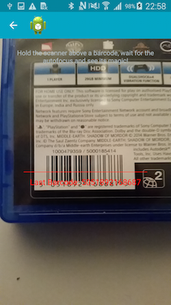

# Rb.Forms.Barcode

## What is this?

Rb.Forms.Barcode is a **Xamarin.Forms view for scanning barcodes**.
It provides continuous scanning, aims to give high control to the user  combined with high stability.

[Available via Nuget](https://www.nuget.org/packages/Rb.Forms.Barcode), full of awesomeness and also unicorns.

**Please note** that the library currently supports Android.

We are very eager about your feedback, so do not hesitate to create an issue or feel free to improve our code via a contribution.

### Features

* Fully Xamarin.Forms compatible. Add elements on top and adapt the ui to your needs.
* Lots of configuration options, bindable properties and events. E.g. torch control or preview freezing.
* Continuous scanning!
* Utilizing [Google Play Services Vision API](https://developers.google.com/vision/) on Android for best possible barcode scanning performance.

## Setup

1. Install the [package via nuget](https://www.nuget.org/packages/Rb.Forms.Barcode) into your PCL and platform specific projects.
2. [Set the appropriate Android permissions](http://developer.android.com/guide/topics/media/camera.html#manifest) to allow your app to access the camera and flash if need be.
4. Add the registration call `BarcodeScannerRenderer.Init();` to your platform specific Main class. 
4. Use the `BarcodeScanner` class in your c# or xaml code.

Example implementation of the Init call:

```
base.OnCreate(bundle);  
Xamarin.Forms.Forms.Init(this, bundle);  
// this is important so that the compiler picks up the assembly reference
BarcodeScannerRenderer.Init();
```

## Usage

1. Create an instance of the `BarcodeScanner` class. Dont forget to give it a height and width.
2. Register an EventHandler for the `BarcodeScanner.BarcodeChanged` event to receive the detected barcodes.

For a hands on experience it is recommended to [take a look at the sample application](#Sample).

### Please note

The scanning starts as soon as the element is visible on screen and stops when the page holding the element gets removed from the stack.

The library tries to handle the basic camera control automagically. This includes starting/halting the preview and more important opening and releasing the camera when navigating to a page or removing it from the stack.

Given the complexity of apps there are a lot of combinations that prevent a reasonable automatic control of the camera. For example when [sleeping](Sample/Sample.Pcl/Pages/ScannerPage.xaml.cs#L18)/[resuming](Sample/Sample.Pcl/Pages/ScannerPage.xaml.cs#L19) the device, when the [page gets disposed](Sample/Sample.Pcl/Pages/ScannerPage.xaml.cs#L74-L76) without notifying the view or another page get pushed onto the stack.

Thats why you should weave in camera control code into the logic of your app by utilizing the offered bindings. Not doing so might lead to bad performance or unexpected camera exceptions.

Do's:

* Disable the preview when you add a page to the navigation stack.
* Disable the camera when the page gets removed from the stack.
* Disable the camera when sleeping the device.
* Ensure that only one instance at at time is active.

### Bindable properties and events

All events are also available as `Command`s, the appropriate fields are suffixed accordingly. E.g. the command for `BarcodeChanged` event would be `BarcodeChangedCommand`.

What | Type | Description
---- | ---- | -----------
`BarcodeScanner.BarcodeChanged` | EventHandler | Raised only when the barcode text changes.
`BarcodeScanner.BarcodeDecoded` | EventHandler | Raised every time when a barcode is decoded from the preview, even if the value is the same as the previews one.
`BarcodeScanner.PreviewActivated` | EventHandler | Raised after the preview image gets active.
`BarcodeScanner.PreviewDeactivated` | EventHandler | Raised after the preview image gets deactivated.
`BarcodeScanner.CameraOpened` | EventHandler | Raised after the camera was obtained.
`BarcodeScanner.CameraReleased` | EventHandler | Raised after the camera was released.
`BarcodeScanner.Barcode` | Property | Holds the value of the last found barcode.
`BarcodeScanner.IsEnabled` | Property | If `true` opens the camera and activates the preview. `false` deactivates the preview and releases the camera.
`BarcodeScanner.PreviewActive` | Property | If `true` the preview image gets updated. `false` no preview for you!
`BarcodeScanner.BarcodeDecoder` | Property | If `true` the decoder is active and tries to decode barcodes out of the image. `false` turns the decoder off, the preview is still active but barcodes will not be decoded.
`BarcodeScanner.Torch` | Property | Controls the camera flashlight if available and accessible. `true` sets the camera to torch mode (always on), `false` turns the flashlight off.

### Configuration

Configuration can be applied by passing a `Configuration` object to the `BarcodeScannerRenderer.Init()` method. As the available options are platform specific, the configuration has to be done in the according platform solution. The corresponding [Android](Rb.Forms.Barcode.Droid/Configuration.cs) class documentation should give you a solid understanding of the available options. 

By default the compatibility mode is enabled to ensure the highest device compatibility. 

Simple example:

    var config = new Configuration {
        // Some devices, mostly samsung, stop auto focusing as soon as one of the advanved features is enabled.
        CompatibilityMode = Build.Manufacturer.Contains("samsung")
    };

    BarcodeScannerRenderer.Init(config);

### Debugging

Rb.Forms.Barcode provides you with a tremendous amount of debug information, so check your application log if anything goes wrong:

```
[Rb.Forms.Barcode] [BarcodeScannerRenderer] OnElementChanged
[Rb.Forms.Barcode] [BarcodeScannerRenderer] OnElementPropertyChanged
[Rb.Forms.Barcode] [BarcodeScannerRenderer] SurfaceCreated
[Rb.Forms.Barcode] [BarcodeScannerRenderer] SurfaceChanged
[Rb.Forms.Barcode] [CameraConfigurator] Focus Mode [continuous-picture]
[Rb.Forms.Barcode] [CameraConfigurator] Scene Mode [auto]
[Rb.Forms.Barcode] [CameraConfigurator] Metering area [True]
[Rb.Forms.Barcode] [CameraConfigurator] Focusing area [True]
[Rb.Forms.Barcode] [CameraConfigurator] Video stabilization [True]
[Rb.Forms.Barcode] [CameraConfigurator] White balance [auto]
[Rb.Forms.Barcode] [BarcodeScannerRenderer] OnElementPropertyChanged
[ScannerView] OnBarcodeChanged [886970911399 - UpcA]
[ScannerView] OnBarcodeDecoded [886970911399 - UpcA]
Decoded barcode [886970911399 - UpcA]
[Rb.Forms.Barcode] [BarcodeScannerRenderer] SurfaceDestroyed
[Rb.Forms.Barcode] [BarcodeScannerRenderer] OnElementPropertyChanged
[Rb.Forms.Barcode] [BarcodeScannerRenderer] Enabled [False]
[Rb.Forms.Barcode] [BarcodeScannerRenderer] OnElementPropertyChanged
[Rb.Forms.Barcode] [BarcodeScannerRenderer] Disposing
```

## Sample

There is a [full working sample](Sample/) in the github repository that should give you a headstart. The relevant code is included in the PCL part of the project. The sample is part of the project solution.



## Whats planed

Take a look at our [planned features issue list](https://github.com/rebuy-de/rb-forms-barcode/labels/planned%20feature) or even better contribute! :)

## Contributing

Don't hesitate to fork and improve the code, as long as you share it with us. ;)
